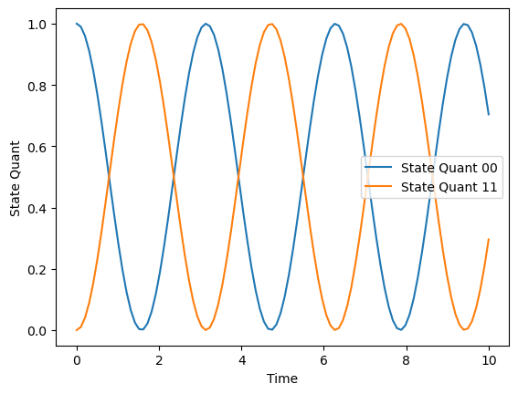

#Tutoriales

Para empezar a trabajar se deben asignar los valores del operador y del estado inicial del sistema, en el tiempo $t=0s$. Luego, con las funciones se evalua la dinámica temporal en una grilla temporal unidimensional. se crea un linespace para reccorer una lista de valores y obtiene el valor de la variable de paso temporal. Y se crea una rutina para realizar la evolución temporal. 

Pero antes se necesir¿ta una copia del operador que representa el estado inicial. Se llama de manera iterativa la rutina `rk4()`, calculando el operador del estado del sistema $\mathbf{y}(t)$ a través del tiempo. A travéz del tiempo, se guarda la entrada $(0, 0)$ y $(1, 1)$ de la matriz $\mathbf{y}(t)$. 

Para esto, se crean dos arreglos que van a contener los valores con valores iniciales cero. Se utiliza el mismo tamaño del arreglo que contiene la variable independiente temporal. 

Se empieza con el for y se guardan las variables en sus respectivos "espacios", y el valor obtenido de `rk4()` se reemplza por el $y_{n}$ de esta manera, en la siguiente iteración, el operador de esta iteración se convierte en el inicial de la siguiente iteración

La siguiente gráfica es un resultado obtenido mediante estas funciones:

